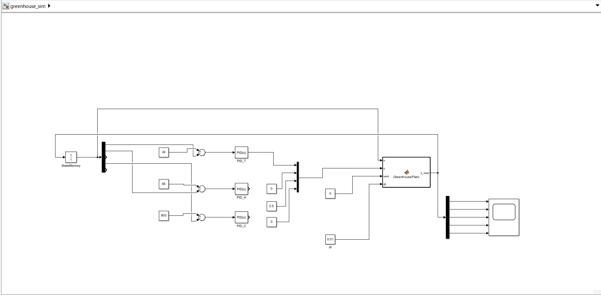

# Greenhouse Control System

MATLAB and Simulink implementation of a linear greenhouse control system using continuous and discrete mathematical models, PID control, relay logic, and sustainability analysis.

---

# Simulink Model

The project includes a Simulink implementation of the greenhouse system in addition to the MATLAB implementation.

The Simulink model represents the greenhouse dynamics graphically and can be used for system visualization and validation.

---

# Project Overview

This project presents a simplified smart greenhouse control system developed in MATLAB and Simulink.

The greenhouse is modeled using five state variables:

- Temperature
- Air Humidity
- Soil Moisture
- CO₂ Concentration
- Plant Biomass

The objective is to simulate greenhouse dynamics, design automatic controllers, and evaluate sustainability through water and energy management.

---

# Project Objectives

- Develop a mathematical greenhouse model
- Simulate continuous-time dynamics
- Implement discrete-time simulation
- Compare Euler and ODE45 methods
- Design PID controllers
- Implement relay controllers
- Control irrigation and ventilation
- Analyze water consumption
- Analyze energy consumption
- Evaluate greenhouse sustainability

---

# Project Parts

## Part 1 – Continuous Greenhouse Model

Continuous-time simulation of the greenhouse using MATLAB ODE45.

Files:

- `init.m`
- `greenhouse_ode.m`
- `run_part1_continuous.m`

---

## Part 2 – Discrete-Time Simulation

Implementation of the Forward Euler method and comparison with the continuous model.

Files:

- `greenhouse_step_euler.m`
- `run_part2_discrete.m`

---

## Part 3 – Closed-loop Control

Automatic greenhouse control using PID and Relay controllers.

Controllers:

- PID Temperature Control
- PID Humidity Control
- PID CO₂ Control
- Relay Irrigation Control
- Relay Ventilation Control

Files:

- `init_part3.m`
- `pid_step.m`
- `relay_hyst.m`
- `greenhouse_ode_part3.m`
- `run_part3_control.m`

---

## Part 4 – Sustainability Analysis

Evaluation of greenhouse sustainability under different rainfall scenarios.

The analysis includes:

- Rainwater harvesting
- Water consumption
- Freshwater usage
- Energy consumption
- Biomass production
- Energy efficiency

Files:

- `init_part4.m`
- `simulate_part4.m`
- `run_part4_scenarios.m`

---

# Features

- MATLAB implementation
- Simulink implementation
- Continuous greenhouse model
- Discrete greenhouse model
- ODE45 simulation
- Forward Euler method
- PID control
- Relay control with hysteresis
- Automatic irrigation
- Automatic ventilation
- Rainwater harvesting
- Water consumption analysis
- Energy consumption analysis
- Biomass growth simulation
- Sustainability evaluation

---

# Repository Structure

| File | Description |
|------|-------------|
| `greenhouse_sim.slx` | Simulink greenhouse model |
| `init.m` | Greenhouse model parameters |
| `greenhouse_ode.m` | Continuous mathematical model |
| `greenhouse_step_euler.m` | Euler discretization |
| `run_part1_continuous.m` | Continuous simulation |
| `run_part2_discrete.m` | Continuous vs discrete comparison |
| `init_part3.m` | Control parameters |
| `pid_step.m` | PID controller |
| `relay_hyst.m` | Relay controller |
| `greenhouse_ode_part3.m` | Controlled greenhouse model |
| `run_part3_control.m` | Closed-loop simulation |
| `init_part4.m` | Sustainability parameters |
| `simulate_part4.m` | Water and energy calculations |
| `run_part4_scenarios.m` | Sustainability scenario analysis |

---

# Results

## Simulink Model

---

## Part 1 – Continuous Greenhouse Model

---

## Part 2 – Continuous vs Euler Simulation

---

## Part 3 – Closed-loop PID Control

---

## Part 4 – Sustainability Analysis

---

# Software

- MATLAB R2025b
- Simulink

---

# Topics Covered

- Greenhouse Control
- Dynamic System Modeling
- PID Control
- Relay Control
- Continuous-Time Systems
- Discrete-Time Systems
- Numerical Simulation
- ODE45
- Forward Euler Method
- Smart Agriculture
- Water Management
- Energy Analysis
- Sustainability

---

# Author

**Pardis Eshghinejad**

Master's Student in Computer Engineering (Artificial Intelligence)

University of Genoa
