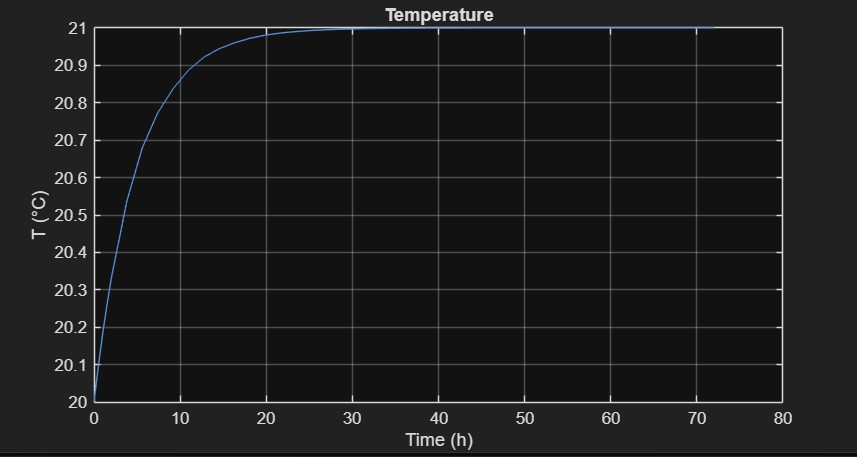
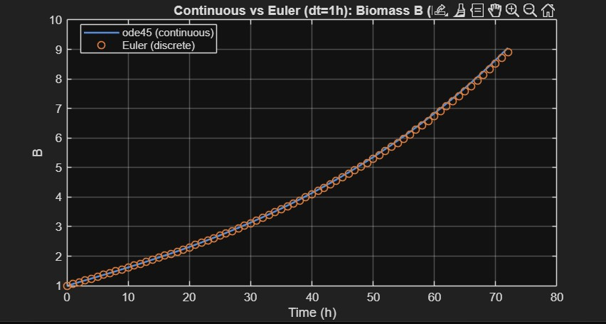
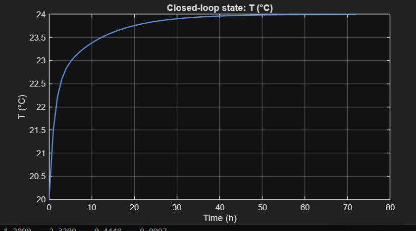
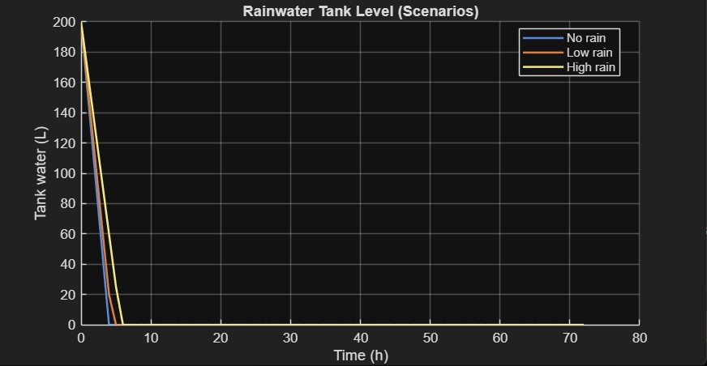

# Greenhouse Control System

MATLAB simulation and control of a linear greenhouse system using continuous and discrete models, PID control, relay logic, and sustainability analysis.

---

## Project Overview

This project presents a simplified linear greenhouse model developed in MATLAB. The greenhouse dynamics include temperature, humidity, soil moisture, CO₂ concentration, and plant biomass growth.

The project is divided into four main parts:

- Continuous-time simulation
- Discrete-time simulation using Euler method
- Closed-loop control using PID and Relay controllers
- Sustainability analysis including rainwater harvesting and energy consumption

---

## Features

- Linear greenhouse dynamic model
- Continuous simulation using `ode45`
- Discrete simulation using Forward Euler
- PID control for:
  - Temperature
  - Humidity
  - CO₂ concentration
- Relay control with hysteresis for:
  - Irrigation
  - Ventilation
- Rainwater tank simulation
- Water consumption analysis
- Energy consumption calculation
- Biomass growth analysis

---

## Project Structure

- `init.m` – Model parameters
- `greenhouse_ode.m` – Continuous greenhouse model
- `greenhouse_step_euler.m` – Euler discretization
- `run_part1_continuous.m` – Continuous simulation
- `run_part2_discrete.m` – Continuous vs discrete comparison
- `init_part3.m` – Control parameters
- `pid_step.m` – PID controller
- `relay_hyst.m` – Relay controller with hysteresis
- `greenhouse_ode_part3.m` – Controlled greenhouse model
- `run_part3_control.m` – Closed-loop control simulation
- `init_part4.m` – Sustainability parameters
- `simulate_part4.m` – Water and energy accounting
- `run_part4_scenarios.m` – Sustainability scenario analysis

---

## Results

### Part 1 – Continuous Greenhouse Model

---

### Part 2 – Continuous vs Euler Simulation

---

### Part 3 – Closed-loop PID Control

---

### Part 4 – Sustainability Analysis

---

## Software

- MATLAB R2025b

---

## Author

**Pardis Eshghinejad**

Master's Student in Computer Engineering (Artificial Intelligence)  
University of Genoa

